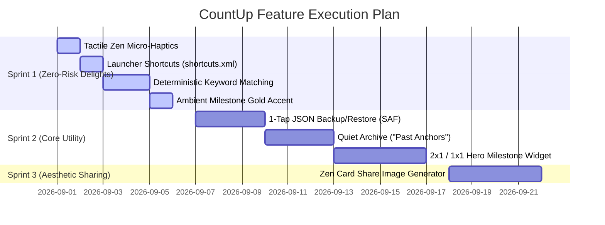

# Technical Architecture & Compose Evaluation: Feature Difficulty & Risk Ranking

## Executive Summary
This document provides a deep architectural and UI engineering evaluation of the 9 brainstormed minimalist features for **CountUp**, conducted from the perspective of **Android System Architecture (MVI, zero-permission, offline storage)** and **Jetpack Compose 2026 UI Engineering (recomposition stability, edge-to-edge, RemoteViews performance)**.

---

## 🏗️ Evaluation Criteria

1. **Implementation Difficulty (1–5)**:
   - Code complexity, new API surfaces, schema impact, testability, and lines of code required.
2. **Architectural & System Risk (1–5)**:
   - Data loss risk, memory allocations, IPC/RemoteViews failure modes, background battery wakeups, Compose recomposition jank, permission leaks.
3. **MVI & Compose Alignment**:
   - Conformance with unidirectional data flow (`CountUpUiState`, `CountUpUiEvent`, `CountUpUiEffect`), `@Immutable` state modeling, and stateless composable contracts.

---

## 📊 Comprehensive Difficulty & Risk Matrix

| Rank (ROI) | Feature | Difficulty (1-5) | Risk (1-5) | Technical Category | Primary Risk Factor | Recommended Sequence |
|:---:|---|:---:|:---:|---|---|:---:|
| **1** | **Tactile Zen Micro-Haptics** | **1.0 (Trivial)** | **1.0 (Zero)** | Compose UI Layer | None (Standard OS `LocalHapticFeedback`) | **Sprint 1** |
| **2** | **App Launcher Shortcuts (`shortcuts.xml`)** | **1.2 (Trivial)** | **1.0 (Zero)** | Android Manifest / Intent | None (Static manifest configuration) | **Sprint 1** |
| **3** | **Deterministic Keyword Matching** | **1.5 (Low)** | **1.1 (Very Low)** | Domain / Dialog State | Fallback when editing existing customized items | **Sprint 1** |
| **4** | **Ambient Milestone Accent (Gold Dot/Enso)** | **1.4 (Low)** | **1.0 (Zero)** | UI Presentation | Pure math derived in composable (`daysSince % 100 == 0`) | **Sprint 1** |
| **5** | **1-Tap JSON Backup & Restore via SAF** | **2.5 (Moderate)** | **2.2 (Low-Med)** | Storage / Activity Contract | Corrupt JSON parsing / Schema validation on restore | **Sprint 2** |
| **6** | **Quiet Archive Section ("Past Anchors")** | **2.8 (Moderate)** | **2.0 (Low)** | Data Model & MVI State | Item schema addition (`isArchived: Boolean`) | **Sprint 2** |
| **7** | **Focused 2x1 / 1x1 Hero Item Widget** | **3.2 (Moderate)** | **2.8 (Medium)** | RemoteViews / Broadcast IPC | Widget configuration Activity & widget sizing bounds | **Sprint 2** |
| **8** | **Zen Card Share Image Generator** | **3.5 (Medium-High)**| **2.9 (Medium)** | Graphics Canvas / Bitmap Cache | Bitmap OOM on high-DPI screens & scoped storage URI | **Sprint 3** |
| **9** | **Card Reordering / Drag-to-Pin** | **4.2 (High)** | **3.8 (High)** | Compose Gesture & Sort MVI | Jitter in `animateItemPlacement` & sort order collision | **Backlog** |

---

## 🔍 Deep Technical Breakdown Per Feature

---

### 1. Tactile Zen Micro-Haptics
- **Architectural Scope**: Purely local UI presentation layer.
- **Implementation Mechanics**:
  - Inject `val haptics = LocalHapticFeedback.current` into [`ZenTheme.kt`](file:///d:/Github/countUp/app/src/main/java/com/countup/app/ZenTheme.kt) or inside `Modifier.pressScale()`.
  - Trigger `haptics.performHapticFeedback(HapticFeedbackType.TextHandleMove)` (or `SegmentTick` on API 34+) on button clicks, swatch taps, and filter switching.
- **Difficulty (1.0/5)**: ~10 lines of code.
- **Risk (1.0/5)**: Zero risk. Requires 0 Android permissions (Android allows standard tactile UI haptics without `VIBRATE` permission). Gracefully silent on devices without haptic motors.
- **Compose Stability**: No recomposition overhead; invoked strictly inside event callbacks.

---

### 2. App Launcher Shortcuts (`shortcuts.xml`)
- **Architectural Scope**: Android OS Framework & Intent Dispatch.
- **Implementation Mechanics**:
  - Add `res/xml/shortcuts.xml` defining `<shortcut android:shortcutId="new_counter">`.
  - Declare `<meta-data android:name="android.app.shortcuts" android:resource="@xml/shortcuts" />` on `MainActivity` in `AndroidManifest.xml`.
  - In `MainActivity.onCreate()` / `onNewIntent()`, check for `intent.data == Uri.parse("countup://new")` and dispatch `viewModel.onEvent(CountUpUiEvent.OpenEditor())`.
- **Difficulty (1.2/5)**: Static XML declaration + 5 lines in `MainActivity`.
- **Risk (1.0/5)**: Zero runtime risk. 0% battery impact, 0 permissions.

---

### 3. Deterministic Keyword Icon & Color Auto-Matching
- **Architectural Scope**: Pure Domain logic in [`ItemIcons.kt`](file:///d:/Github/countUp/app/src/main/java/com/countup/app/ItemIcons.kt) consumed by [`CountUpDialogs.kt`](file:///d:/Github/countUp/app/src/main/java/com/countup/app/CountUpDialogs.kt).
- **Implementation Mechanics**:
  - Create a lightweight compile-time lookup table `matchKeywordPreset(name: String): KeywordMatch?`.
  - In `ItemEditorDialog`, when `item == null` and user types into the name TextField, dynamically update `selectedIcon` and `selectedCardColor` *only if* the user has not manually tapped an icon/color swatch during that session (`hasUserManuallyCustomized: Boolean = false`).
- **Difficulty (1.5/5)**: ~30 lines in `ItemIcons.kt` and minor state binding in `CountUpDialogs.kt`.
- **Risk (1.1/5)**: Very low.
  - *Edge Case*: If user types "Haircut" then deletes it and types "Car", icon shifts smoothly from scissors to automobile. If user manually tapped a specific badge first, typing does not clobber their manual choice.

---

### 4. Ambient Milestone Accent (Quiet In-App Gold Accent)
- **Architectural Scope**: Stateless Composable rendering in [`CountUpContent.kt`](file:///d:/Github/countUp/app/src/main/java/com/countup/app/CountUpContent.kt).
- **Implementation Mechanics**:
  - In `CountUpCard`, evaluate `val isMilestone = remember(item.epochDay, today) { isMilestoneDay(daysSince(item.epochDay, today)) }`.
  - Milestones: `setOf(7, 30, 50, 100, 200, 365, 500, 1000, 10000)`.
  - Render a subtle 4dp metallic bronze/gold deboss dot beside the day count or a delicate enso circle accent.
- **Difficulty (1.4/5)**: Pure Composable decoration.
- **Risk (1.0/5)**: Zero risk. Derived state wrapped in `remember(keys)` ensures 0 unnecessary recompositions.

---

### 5. 1-Tap JSON Backup & Restore via Storage Access Framework (SAF)
- **Architectural Scope**: System File I/O & `CountUpStore` Integration.
- **Implementation Mechanics**:
  - In `MainActivity`, register `rememberLauncherForActivityResult(ActivityResultContracts.CreateDocument("application/json"))` for Export and `OpenDocument()` for Import.
  - Export: Write `CountUpStore.exportJson()` directly to output URI via `contentResolver.openOutputStream(uri)`.
  - Import: Read JSON string from input URI -> pass through `CountUpStore.salvageItems()` with strict validation before applying -> emit `CountUpUiEffect.ShowSnackbar` with count of restored items.
- **Difficulty (2.5/5)**: ~80 lines. Requires handling ContentResolver streams safely with `use {}`.
- **Risk (2.2/5)**:
  - *Risk 1 (Data Corruption on Bad Import)*: Must validate that imported JSON contains valid `CountUpItem` fields. If malformed, fail gracefully without wiping existing SharedPreferences. (Mitigated by reusing `salvageItems()`).
  - *Risk 2 (Permission Posture)*: SAF uses Android system document picker, requiring **zero `<uses-permission>`** in the manifest.

---

### 6. Quiet Archive Section ("Past Anchors")
- **Architectural Scope**: Data Schema, Repository, and MVI Filtering.
- **Implementation Mechanics**:
  - Extend `CountUpItem` with `val isArchived: Boolean = false`.
  - `CountUpUiState.displayItems` filters out `isArchived == true`.
  - Add collapsible `ArchivedItemsSection` at the bottom of `LazyColumn` with distinct muted ink styling.
  - Add `CountUpUiEvent.ToggleArchive(id: String)`.
  - Widget ignores archived items (`items.filter { !it.isArchived && it.showInWidget }`).
- **Difficulty (2.8/5)**: Requires updating `CountUpItem` JSON serialization, `CountUpStoreTest`, and UI list partitions.
- **Risk (2.0/5)**:
  - *Backward Compatibility*: Old JSON payloads without `"isArchived"` must default safely to `false` via `optBoolean("isArchived", false)`.

---

### 7. Focused 2x1 / 1x1 Hero Milestone Widget
- **Architectural Scope**: Android AppWidget Framework & RemoteViews Canvas.
- **Implementation Mechanics**:
  - Add `HeroCountUpWidget : AppWidgetProvider` with `res/xml/hero_widget_info.xml` (`minWidth = 110dp`, `minHeight = 110dp`, `targetCellWidth = 2`, `targetCellHeight = 1`).
  - Add `HeroWidgetConfigureActivity` so the user can select *which* single item the widget displays (stored in `hero_widget_prefs`).
  - Layout: Large serif numeral (`48sp`), icon badge, name, dynamic `SINCE <date>`, rendering with `WidgetBackgroundRenderer`.
- **Difficulty (3.2/5)**: Widget configuration Activity + XML layouts + multi-instance widget state mapping.
- **Risk (2.8/5)**:
  - *Risk 1 (RemoteViews Sizing)*: Widget resizing across different Android launchers (Samsung OneUI, Pixel Launcher, Nova) requires flexible RemoteViews with `minHeight` / `minWidth` bounds.
  - *Risk 2 (Deleted Item Orphan)*: If the selected hero item is deleted in the app, widget must fall back gracefully to a placeholder ("Tap to select item").

---

### 8. Zen Card Share Image Generator
- **Architectural Scope**: Offscreen Canvas Graphics & File Provider.
- **Implementation Mechanics**:
  - Render an offscreen `android.graphics.Bitmap` (e.g. 1080x1350 4:5 portrait) with authentic paper background, Chinese ink wash vector motifs, serif typography, and item stats.
  - Save to cache directory `context.cacheDir/shares/milestone.png`.
  - Trigger `Intent.createChooser(Intent(ACTION_SEND).putExtra(EXTRA_STREAM, contentUri))` via `FileProvider`.
- **Difficulty (3.5/5)**: Custom Android Canvas text layout measurement (`StaticLayout`), DPI scaling, and FileProvider manifest setup.
- **Risk (2.9/5)**:
  - *Risk 1 (Bitmap OOM)*: Large bitmap allocations on low-memory devices (API 26). Must strictly allocate <= 1080x1080 RGB_565 or ARGB_8888 (<4.5 MB RAM) and recycle immediately after stream copy.
  - *Risk 2 (FileProvider)*: Requires clean `<provider>` in manifest with `paths.xml` pointing to `cache-path`.

---

### 9. Card Reordering / Drag-to-Pin
- **Architectural Scope**: Compose Gesture Processing, Animation Physics, and Persistence Order.
- **Implementation Mechanics**:
  - Add `val sortIndex: Long` to `CountUpItem` or add `SortOrder.CUSTOM`.
  - Implement drag-and-drop gesture detection on `LazyColumn` items using `Modifier.pointerInput` and coordinate offsets.
- **Difficulty (4.2/5)**: High. Complex gesture disambiguation between drag-to-reorder, click-to-edit, and scroll fling.
- **Risk (3.8/5)**:
  - *Risk 1 (Recomposition Jank)*: High frequency offset mutations during dragging cause severe frame drops if not isolated into graphics layers (`Modifier.offset { IntOffset(...) }`).
  - *Risk 2 (Sort State Collision)*: If user sorts by "Days Ascending" then drags an item, the sort contract breaks unless a distinct "Manual / Custom" sort mode is introduced.

---

## 🎯 Architecture-Approved Execution Roadmap

### Recommendation Summary
1. **Sprint 1 (Immediate Quick Wins / Zero Risk)**:
   - Implement **Micro-Haptics**, **Launcher Shortcuts**, **Deterministic Keyword Matching**, and **Ambient Milestone Accents**.
   - Total impact: Massive reduction in cognitive friction with **0 new dependencies, 0 permissions, and 0 architectural risk**.
2. **Sprint 2 (High-Value Utilities)**:
   - Implement **JSON Backup/Restore via SAF**, **Quiet Archive**, and **Hero Milestone Widget**.
3. **Sprint 3 (Visual Polish)**:
   - Implement **Zen Card Share Image Generator** with strict memory profiling.
4. **Deferred (High Complexity / Low Minimalist ROI)**:
   - Keep manual Drag-to-Pin in backlog to avoid cluttering the existing 1-tap Sort & Search pipeline.
